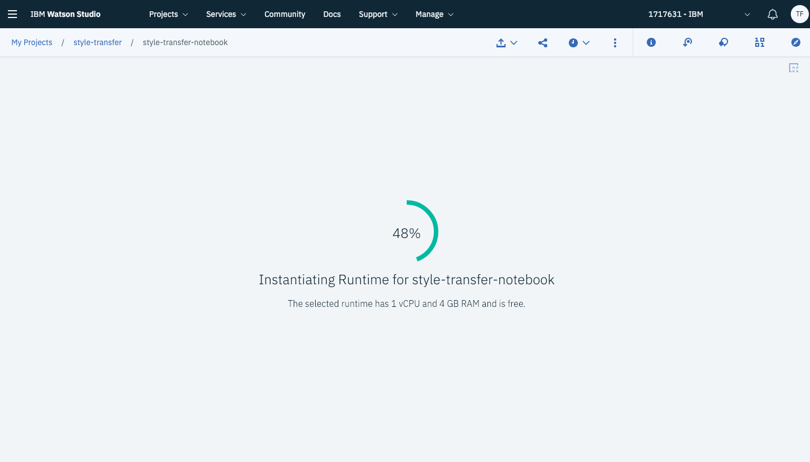

# Watson Machine Learning - PyTorch Style Transfer

This readme acts as a step by step guide to using the [Watson Machine Learning](https://www.ibm.com/cloud/machine-learning) service for GPUs in the IBM Cloud. The code itself is for a Style Transfer workload, applying the "style" of one image to the "content" of another.

If you're interested in finding out more about style transfer check out [this paper](https://www.cv-foundation.org/openaccess/content_cvpr_2016/papers/Gatys_Image_Style_Transfer_CVPR_2016_paper.pdf).

So what does this repo contain?

1. pytorch-model - Location of the PyTorch script that does the style transfer.
2. wml-style-transfer.ipynb - Notebook that executes the PyTorch script via the WML service.
3. style-transfer-images - Location of sample images to use for Style Transfer. I'd suggest using your own though.

## PyTorch Script Usage

You are of course free to use the python script `./pytorch-model/style-transfer.py` anywhere you like. Actually, I'd encourage it, but you'll need either GPUs or a whole lot of time.

The script takes a couple of command line arguments to let you specify style/content images as well as the number of training iterations.

**Usage**:

```

python3 ./pytorch-model/style-transfer.py --styleImageFile ${DATA_DIR}/style.png --contentImageFile ${DATA_DIR}/content.jpeg --trainingIters 1000

```

## Tutorial..

### Create Watson Studio Service

* Visit https://cloud.ibm.com/ and create a Watson Machine Learning service.

* Click the Catalog tab and search "Watson Studio".


* Create a "Lite" Watson Studio instance and click "Get Started"


### Create a Watson Studio project

* From the landing page select "create project" and select "deep learning"


This will initialise a Cloud Object Storage instance and Watson Machine Learning service automatically.

* Name your project (something like Style Transfer) and It'll automatically connect to the WML/COS instances.


### Create a Notebook asset

* Click the "add to project" button and "notebook" to create a Jupyter notebook.


* Select from URL and insert the URL to the Jupyter notebook in this repo.

``` https://github.com/ChrisParsonsDev/wml-pytorch-style-transfer/blob/master/wml-style-transfer.ipynb

 ```

 


* Choose the relevant python version/instance size


* You'll then see Watson Studio create the notebook from our template.



### Upload Style and Content images

* Select "find and add data" it's the little icon that looks like 4 bits.


* Download the style.jpeg and content.png images from `./style-transfer-images`

* Drag and drop them to upload them to the COS storage instance


### Obtaining Credentials

#### Cloud Object Storage

* Select "Insert Credentials" to automatically import your COS credentials to the notebook. (it doesn't matter which image)


* To connect the notebook to your WML/COS instances you'll need to obtain some API credentials. Click [this link](https://cloud.ibm.com/resources) to view your resources.


* Select "Cloud Object Storage" - it might have a name like cloud-object-storage-dsx (or similar).

* Visit the "Service Credentials" tab.


* Copy your "editor" credentials to clipboard


* Paste them into the `cos_credentails` dictionary in the notebook.

#### Watson Machine learning

* To connect the notebook to your WML/COS instances you'll need to obtain some API credentials. Click [this link](https://cloud.ibm.com/resources) to view your resources.

* Select "Watson Machine Learning" - it might have a name like pm-20-dsx (or similar).

* Visit the "Service Credentials" tab.

* Copy your "writer" credentials to clipboard


* Paste them into the `wml_credentials` dictionary in the notebook.

### Run the notebook!

* Start running the code cells in the notebook, from the top down, to run the Style Transfer job with the WML service

* To view the status of your job at any time run this cell:


* The status will change to:


### Seeing the results

* To view the results of the job, you'll need to visit the COS bucket. Click [this link](https://cloud.ibm.com/resources.png) to view your resources, select the COS bucket as before.


* Select the trained images, and "download"


* It should look a little like this...


